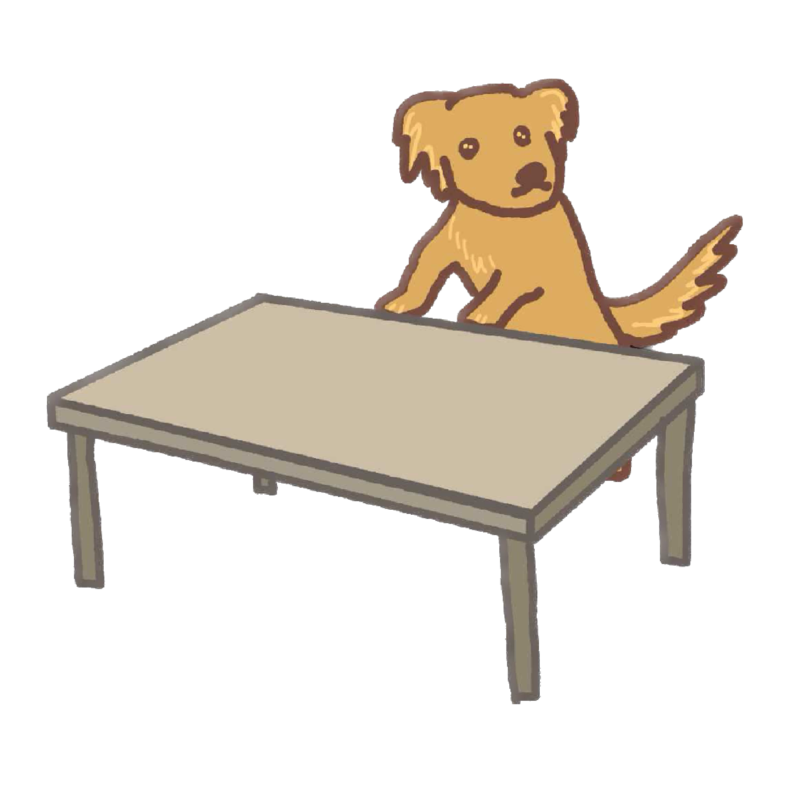

<div id="top">

<!-- HEADER STYLE: CLASSIC -->
<div align="center">



# Tic Tac Toe Streamlit Application

<em>Play the classic Tic Tac Toe game with a friend or an AI opponent.</em>

<!-- BADGES -->


<!-- default option, no dependency badges. -->


<!-- default option, no dependency badges. -->

</div>
<br>

# 

## Overview

This repository contains a **Streamlit** based implementation of the classic **Tic‑Tac‑Toe** game, enhanced with AI capabilities. The project showcases a clean separation of concerns, modular components, and a simple UI that allows you to play against another human or an AI opponent powered by the **liteLLM** library.

## Features

- **Two‑Player Mode** – Play locally against a friend.
- **AI Player** – Challenge an AI opponent that uses language model prompts to decide moves.
- **Session Memory** – Global memory handling via Streamlit’s `session_state` to keep track of game history and tool calls.
- **Customizable Styling** – Simple CSS (`style.css`) to tweak the appearance.
- **Modular Architecture** – Core game logic, AI logic, UI utilities, and configuration are split into dedicated modules for readability and extensibility.

## Quick Start 
### Web Application
> 📍Access the game via [this link](https://tic-tac-toe-with-agent.streamlit.app/).
### On-premise
1. **Clone the repository**
   ```bash
   git clone https://github.com/Wh4130/tic_tac_toe.git
   cd tic_tac_toe
   ```

2. **Create a virtual environment (optional but recommended)**
   ```bash
   python -m venv venv
   source venv/bin/activate   # On Windows use `venv\Scripts\activate`
   ```

3. **Install the required packages**
   ```bash
   pip install -r requirements.txt
   ```

4. **Configure environment variables**

   Create a `secrets.toml` file in `.streamlit` folder, containing `CEREBRAS_API_KEY` constant.

## Running the Application

Launch the Streamlit app with:

```bash
streamlit run app.py
```

The UI will open in your default web browser. You can select **Human vs Human** or **Human vs AI** modes, make moves by clicking on the board, and view the game history.


*Happy coding and enjoy the game!*